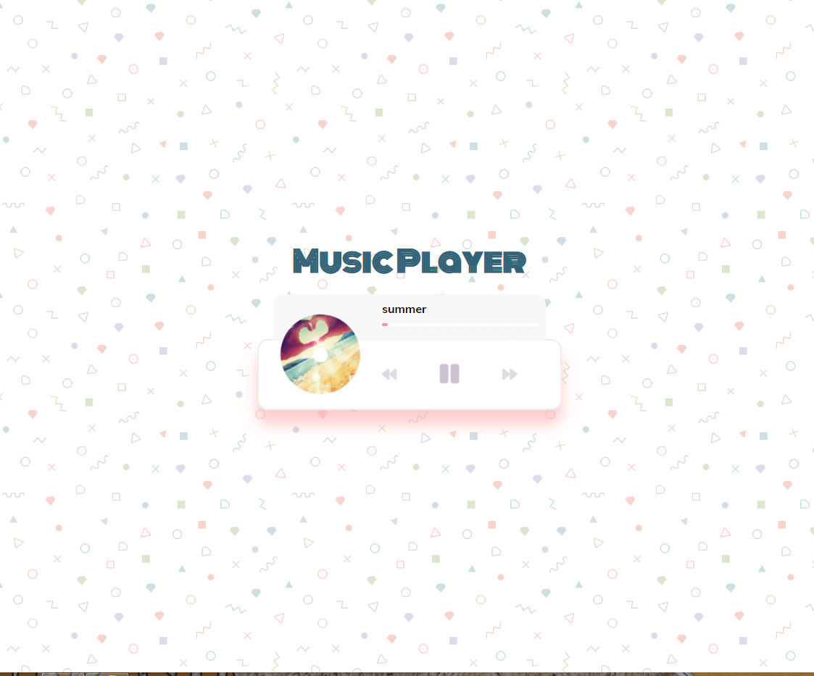

# Music Player

> Create beautiful UI to play music stored in the "music folder" using the HTML5 audio API

### [Demo](http://music-player-js-ab.surge.sh)
[](https://radikal.ru/video/A7qYK0Ct5bJ)

### Get started

```shell script
git clone
```
```shell script
open index.html
```
or
```shell script
npm i -g live-server
```
```shell script
live-server
```
